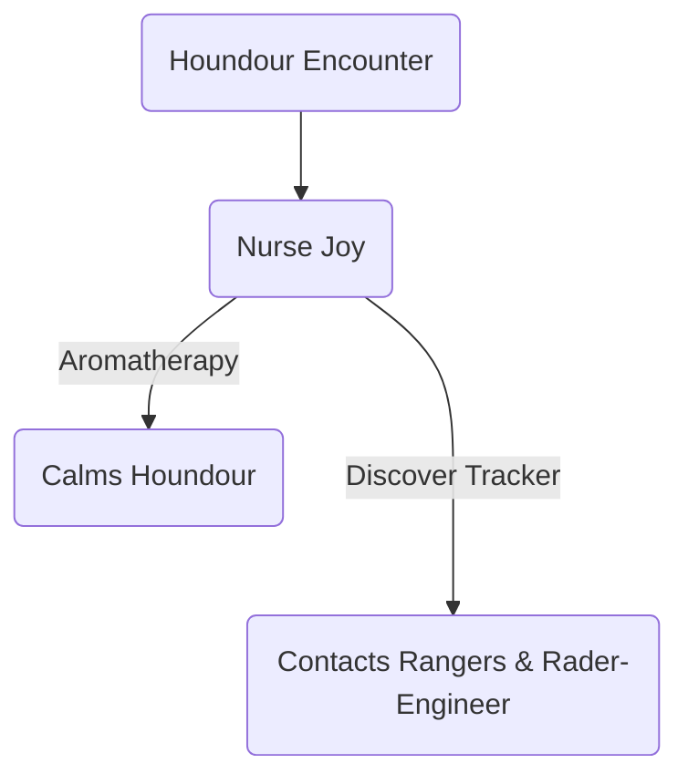

---
aat-event-title:
aat-render-endable: true
aat-event-date: 2025-10-18
timeline: [Halay]
---

#Seed:
- Esther wants a Pokemon w/ Aromatherapy to help her calm down Houndour, it would also help w/ Pyrrha

#team-levels :
-  Pyrrha 12 $\to$ 13
	- vs Mincinno
	- vs Houndour

#team-additions:
- Houndour 15