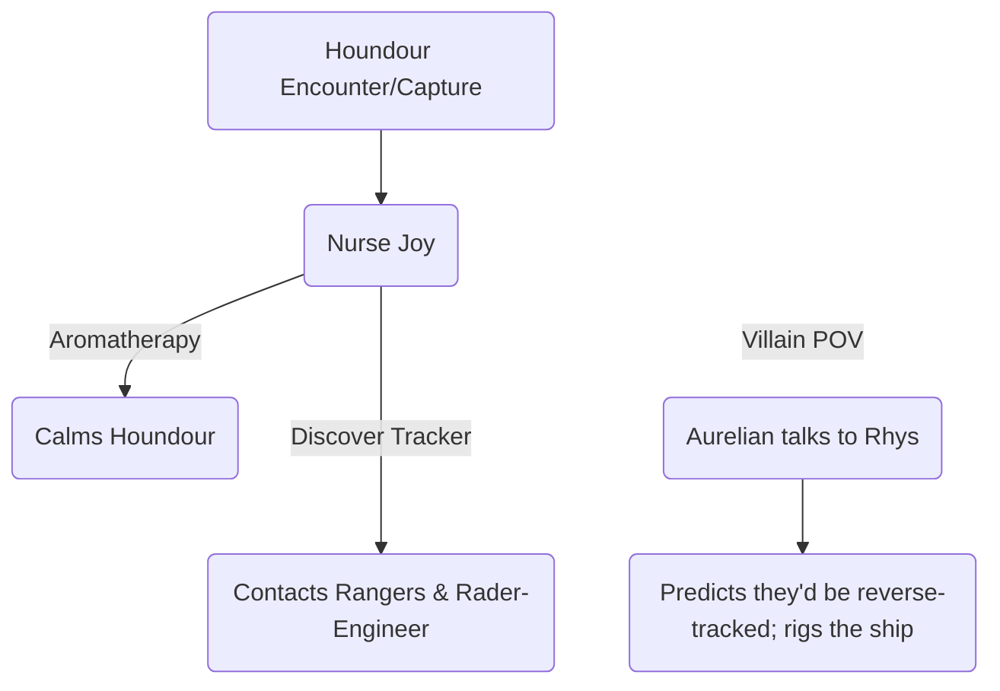

#poke-pov: Houndour
- She's scared & Confused, awakening in an unfamiliar land—who knows where—with her last memories being snatched away from her family. Nevertheless, she brandishes her fangs; to show weakness is to invite offense, this is two-fold for a leader lest their uncertainty trickle down.

#seed-planted
- Aromatherapy:  Esther wants a Pokemon w/ Aromatherapy to help her calm down Houndour, it would also help w/ Pyrrha. 

#team-levels : 2022-06-09
-  Pyrrha Lv.12 $\to$ 14

#team-battles: Pyrrha
	- vs Wilford
	- vs Minccino
	- vs Houndour

#team-additions:
- Houndour Lv.15
