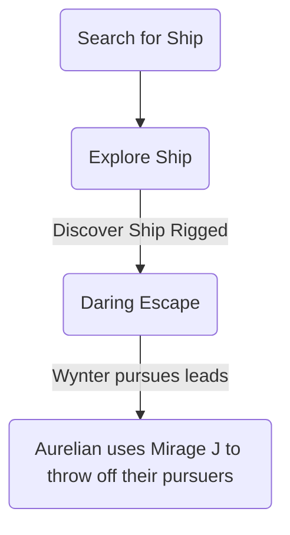

Esther & Co. Search for and locate the derelict of Hunter J's ship. It's rusted and suffering from severe water-damage; it was evidently restored to *some* degree of functionality. Wynter speculates this reduced functionality led to this 'crash landing'.

